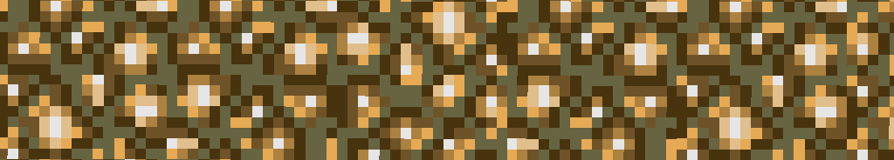

  <h1> Glowstone engine </h1>

Learning Vulkan and real-time path tracing algorithms through the development of a deferred path tracer using a geometry pass for primary rays.
 
 

  

### Disclaimer
In it's current state, the project is a support for learning path tracing algorithms and GPU programming. Some unoptimized or redundant code segments are to be expected.

### Portfolio page
More details on this page:
https://www.lix.polytechnique.fr/~foulon/#/projects/hybrid-hardware-raytracer
